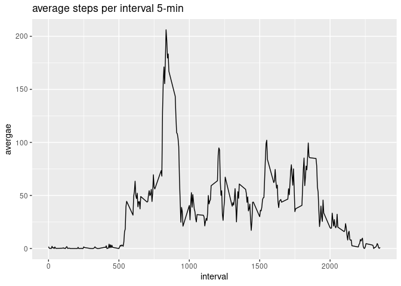
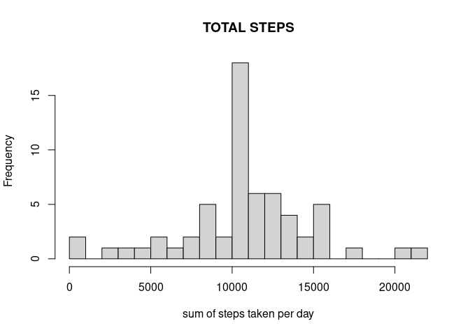

## Loading and preprocessing the data

```r
library(tibble)
library(lubridate)
library(dplyr)
```


```r
temp<-read.csv("repdata_data_activity/activity.csv",header=TRUE)
temp<-transform(temp,date=as.Date(date))
activityData<-tibble::as_tibble(temp)
head(activityData)
```

```
## # A tibble: 6 x 3
##   steps date       interval
##   <int> <date>        <int>
## 1    NA 2012-10-01        0
## 2    NA 2012-10-01        5
## 3    NA 2012-10-01       10
## 4    NA 2012-10-01       15
## 5    NA 2012-10-01       20
## 6    NA 2012-10-01       25
```


## What is mean total number of steps taken per day?
We'll first group and count total number of step done each day then report mean and median


```r
sumofSteps<-tapply(activityData$steps,activityData$date,sum,na.rm=TRUE)
meanstep<-mean(sumofSteps)
mediansteps<-median(sumofSteps)
print("mean of steps:")
print(meanstep)
print("median of steps:")
print(mediansteps)
```


```
## [1] "mean of steps:"
```

```
## [1] 9354.23
```

```
## [1] "median of steps:"
```

```
## [1] 10395
```

now we'll plot using base histogram

<!-- -->

## What is the average daily activity pattern?
for this we gonna need ggplot2 

```r
library(ggplot2)
```

we aggregate data to make correct plot 

```r
intr_avg<-activityData %>% 
    group_by(interval) %>% 
    mutate(avg=mean(steps,na.rm=TRUE))
```

we now find which interval has max avg

```r
intr_avg[which.max(intr_avg$avg),]
```

```
## # A tibble: 1 x 4
## # Groups:   interval [1]
##   steps date       interval   avg
##   <int> <date>        <int> <dbl>
## 1    NA 2012-10-01      835  206.
```

and now the plot 

```r
qplot(intr_avg$interval,intr_avg$avg,geom="line",
      xlab="interval",
      ylab="avergae",
      main="average steps per interval 5-min")
```

<!-- -->

## Imputing missing values
Reporting missing value

```r
missing<-is.na(activityData$steps)
table(missing)
```

```
## missing
## FALSE  TRUE 
## 15264  2304
```

we can fill missing value by avg of interval that day


```r
replacewithmean <- function(x) replace(x, is.na(x), mean(x, na.rm = TRUE))
activityDataNa<-activityData %>% group_by(interval) %>% mutate(steps= replacewithmean(steps)) 
```

Calculating and report mean again 

```r
sumofStepsNA<-tapply(activityDataNa$steps,activityDataNa$date,sum)
meanstep<-mean(sumofStepsNA)
mediansteps<-median(sumofStepsNA)
print("mean of steps:")
print(meanstep)
print("median of steps:")
print(mediansteps)
```


```
## [1] "mean of steps without na:"
```

```
## [1] 10766.19
```

```
## [1] "median of steps without na:"
```

```
## [1] 10766.19
```

now the plot 

```r
hist(sumofStepsNA,xlab="sum of steps taken per day",main = "TOTAL STEPS",breaks=20)
```

<!-- -->

we see that chaning and inputing missing data could have a greta impact on value of mean and media!


## Are there differences in activity patterns between weekdays and weekends?
