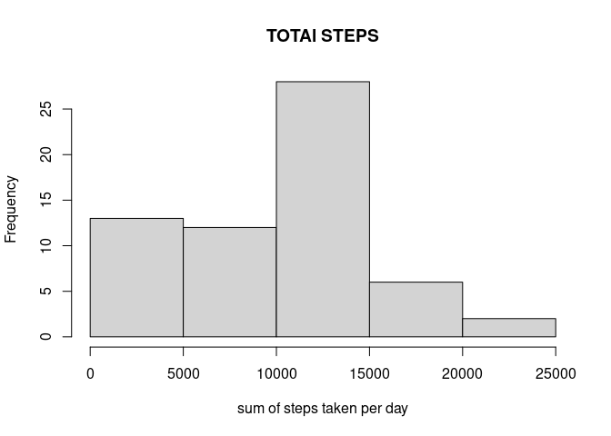

## Loading and preprocessing the data

```r
library(tibble)
library(lubridate)
```


```r
temp<-read.csv("repdata_data_activity/activity.csv",header=TRUE)
temp<-transform(temp,date=as.Date(date))
activityData<-tibble::as_tibble(temp)
head(activityData)
```

```
## # A tibble: 6 x 3
##   steps date       interval
##   <int> <date>        <int>
## 1    NA 2012-10-01        0
## 2    NA 2012-10-01        5
## 3    NA 2012-10-01       10
## 4    NA 2012-10-01       15
## 5    NA 2012-10-01       20
## 6    NA 2012-10-01       25
```


## What is mean total number of steps taken per day?
We'll first group and count total number of step done each day then report mean and median


```r
sumofSteps<-tapply(activityData$steps,activityData$date,sum,na.rm=TRUE)
meanstep<-mean(sumofSteps)
mediansteps<-median(sumofSteps)
print("mean of steps:")
print(meanstep)
print("median of steps:")
print(mediansteps)
```


```
## [1] "mean of steps:"
```

```
## [1] 9354.23
```

```
## [1] "median of steps:"
```

```
## [1] 10395
```

now we'll plot using base histogram

<!-- -->

## What is the average daily activity pattern?


## Imputing missing values


## Are there differences in activity patterns between weekdays and weekends?
